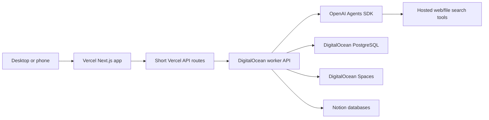

# Architecture

## Runtime Split

## Responsibilities

Vercel:
- Render the research intake form.
- Validate the four required fields before submission.
- Start a backend job and poll job status.
- Show progress, source collection, decision logs, approval requests, saved locations, and final results.

DigitalOcean:
- Run the worker API and long-lived research jobs.
- Persist run status, source records, feedback, audit records, and checkpoints.
- Store generated artifacts and source snapshots in Spaces.
- Host scheduled or queued work when recurring research is added.

OpenAI Agents SDK:
- Own research instructions, tool use, guardrails, workflow orchestration, and final synthesis.
- Use hosted tools such as web search and file search when configured.
- Avoid exposing hidden chain-of-thought. Persist concise summaries instead.

Notion:
- Store the submitted prompt.
- Store the final readable research response.
- Avoid secrets, raw credentials, and hidden internal reasoning.

## Job Lifecycle

1. Validate intake fields.
2. Create run record.
3. Save prompt to Notion when configured.
4. Retrieve prior knowledge and current instructions.
5. Run source discovery and synthesis through the worker.
6. Save checkpoints and concise tool summaries.
7. Save final response to Notion and artifacts to Spaces.
8. Mark the run complete and show saved locations in the UI.
