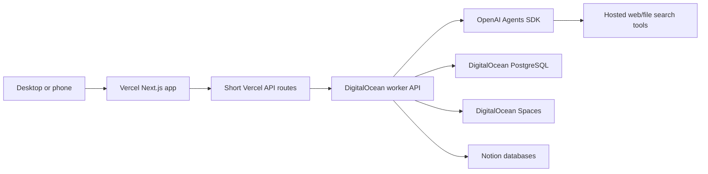

# Architecture

## Runtime Split



## Responsibilities

Vercel:
- Render the research intake form.
- Validate the four required fields before submission.
- Start a backend job and poll job status.
- Show progress, source collection, decision logs, approval requests, saved locations, and final results.

DigitalOcean:
- Run the worker API and long-lived research jobs.
- Persist run status, source records, feedback, trust reports, proposed updates, workflow versions, and checkpoints.
- Store generated reports, source artifacts, transcript artifacts, trust reports, workflow snapshots, and run summaries in Spaces.
- Host scheduled or queued work when recurring research is added.

OpenAI Agents SDK:
- Own research instructions, tool use, guardrails, workflow orchestration, and final synthesis.
- Use hosted tools such as web search and file search when configured.
- Avoid exposing hidden chain-of-thought. Persist concise summaries instead.

Notion:
- Store the submitted prompt.
- Store the final readable research response.
- Keep titles clean and avoid visible run IDs in page names.
- Preserve learning-friendly formatting: bold annotations, readable lists, and source links at the end.
- Avoid secrets, raw credentials, and hidden internal reasoning.

## Job Lifecycle

1. Validate intake fields.
2. Create run record.
3. Save prompt to Notion when configured.
4. Normalize intake so deadline is urgency and research budget is an effort target.
5. Retrieve approved update notes and active workflow context.
6. Build topic-aware source strategy, including YouTube/creator sources when requested or useful.
7. Run source discovery and synthesis through the worker.
8. Review source quality and create a trust report.
9. Save final response to Notion and artifacts to Spaces.
10. Store feedback as pending proposed updates until authorized.
11. Mark the run complete and show saved locations in the UI.

## Authorized Improvement Loop

```text
Run feedback
  -> feedback archive
  -> proposed update note
  -> admin approval on /updates
  -> versioned workflow/source-policy/preference/eval update
  -> future run uses approved context
```

The agent should never silently rewrite itself from feedback. Approved runtime updates are versioned; code and UI changes remain backlog items until implemented and deployed.
